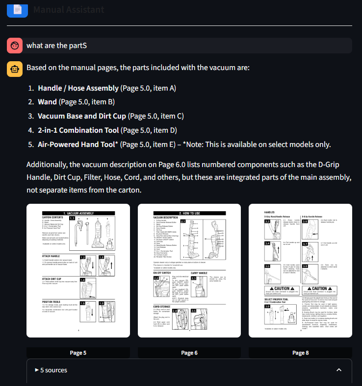
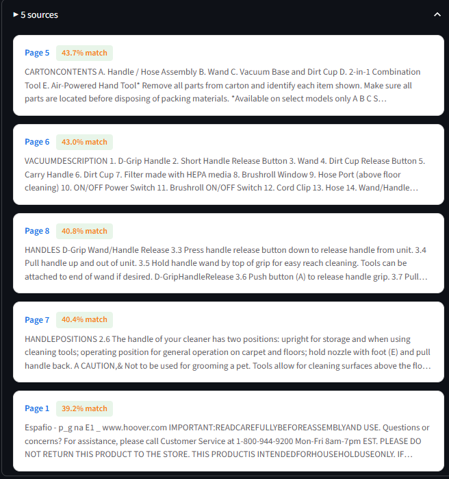

# Manual Assistant — RAG with Gemini Embedding 2 (Multimodal)

> Chat with any PDF manual. Powered by Google's **first natively multimodal embedding model** — `gemini-embedding-2-preview`.

---

## Real Results

Ask a question → get a structured answer + page thumbnails + similarity scores:

<!--  -->

<!-- The sources panel shows each matched page with its **similarity score**: -->

<!--  -->

---

## How `gemini-embedding-2-preview` changed RAG forever

### Before (classic RAG — text only)

```
PDF page → extract text → embed text → vector
```

The model **only sees words**. It misses diagrams, tables, visual layouts, illustrations.

### After (this app — multimodal RAG)

```
PDF page → extract text ┐
           render image ┘ → embed TOGETHER → one unified vector
```

The model sees **everything**: words AND the visual page. One single 1536-dimensional vector captures both.

---

## What the model sees per page

| What we send | Why it matters |
|---|---|
| Extracted **text** | Semantic content, keywords, instructions |
| Rendered **page image** (PNG 2x) | Diagrams, tables, figures, visual layout, illustrations |

→ A query like *"what are the parts"* retrieves pages that have **diagrams of parts** even if the text doesn't perfectly match — because the image embedding carries that visual information.

---

## Similarity scores explained

From the screenshots above, the search returned:

| Page | Score | Why it matched |
| :--- | :--- | :--- |
| Page 5 | **43.7%** | Carton contents diagram — visual list of parts |
| Page 6 | **43.0%** | Vacuum description with numbered component diagram |
| Page 8 | **40.8%** | Handle assembly diagrams |
| Page 7 | **40.4%** | Handle positions with visual instructions |
| Page 1 | **39.2%** | Product overview page |

The multimodal model found pages **with part diagrams** (pages 5, 6, 8) — not just pages with the word "parts" in the text.

---

## Architecture

```text
PDF Manual
    │
    ▼
┌─────────────────────────────────────────────┐
│  ingest.py  (run once)                      │
│                                             │
│  For each page:                             │
│    1. Extract text        (PyMuPDF)         │
│    2. Render page → PNG   (2x resolution)   │
│    3. text + image → embed together         │
│       └─ gemini-embedding-2-preview         │
│          task_type: RETRIEVAL_DOCUMENT      │
│          output_dimensionality: 1536        │
│    4. Upsert vector + metadata → Pinecone   │
└─────────────────────────────────────────────┘
                    │
                    ▼
┌─────────────────────────────────────────────┐
│  app.py  (Streamlit)                        │
│                                             │
│  User question                              │
│    │                                        │
│    ▼                                        │
│  Embed query                                │
│  └─ gemini-embedding-2-preview              │
│     task_type: RETRIEVAL_QUERY              │
│    │                                        │
│    ▼                                        │
│  Search Pinecone (cosine similarity, top 5) │
│    │                                        │
│    ▼                                        │
│  Generate answer ← deepseek-chat            │
│    │                                        │
│    ▼                                        │
│  Show answer + page thumbnails + scores     │
└─────────────────────────────────────────────┘
```

---

## Tech Stack

| Component | Technology |
| :--- | :--- |
| **Embeddings** | `gemini-embedding-2-preview` (Google — multimodal) |
| **Generation** | `deepseek-chat` (DeepSeek) |
| **Vector Store** | Pinecone (serverless, cosine) |
| **PDF Processing** | PyMuPDF (`fitz`) — text + image render |

---

## The embedding code (core of the app)

```python
from google import genai
from google.genai import types

client = genai.Client(api_key="...")

# One page → text + image → single 1536-dim vector
result = client.models.embed_content(
    model="gemini-embedding-2-preview",
    contents=[
        types.Content(parts=[
            types.Part(text=page_text),                           # text
            types.Part.from_bytes(data=image_bytes,               # image
                                  mime_type="image/png"),
        ])
    ],
    config=types.EmbedContentConfig(
        task_type="RETRIEVAL_DOCUMENT",
        output_dimensionality=1536,
    ),
)
embedding = result.embeddings[0].values  # → 1536 floats
```

This is it. **One API call per page.** Text + image fused into one vector.
No chunking strategies, no OCR pipelines, no image captioning — the model handles it all natively.

---

## Getting Started

### 1. Install dependencies

```bash
pip install -r requirements.txt
```

### 2. Configure `.env`

```env
GOOGLE_API_KEY=your_google_api_key
PINECONE_API_KEY=your_pinecone_api_key
PINECONE_INDEX=manual-rag
PDF_PATH=manual/Documents/docc_vocum.pdf
DEEPSEEK_API_KEY=your_deepseek_api_key
```

### 3. Ingest the PDF *(once)*

```bash
python ingest.py
```

Renders each page → PNG, creates multimodal embeddings, pushes to Pinecone.

### 4. Launch

```bash
streamlit run app.py
```

---

## Project Structure

```text
RAG_With_new_model_google/
├── app.py                  # Streamlit UI
├── ingest.py               # PDF ingestion (multimodal embeddings)
├── rag.py                  # RAG query logic
├── requirements.txt
├── .env                    # API keys (not committed)
├── .gitignore
├── images/
│   ├── image.png           # Screenshot: answer + page thumbnails
│   └── image_2.png         # Screenshot: sources with match scores
├── manual/
│   └── Documents/
│       └── docc_vocum.pdf
└── pages_cache/            # Auto-generated by ingest.py
    ├── page_1.png
    └── ...
```

---

## References

- [Gemini Embedding 2 — Google Blog](https://blog.google/innovation-and-ai/models-and-research/gemini-models/gemini-embedding-2/)
- [Gemini Embeddings API Docs](https://ai.google.dev/gemini-api/docs/embeddings)
- [Pinecone Docs](https://docs.pinecone.io)
- [DeepSeek API](https://platform.deepseek.com/docs)
